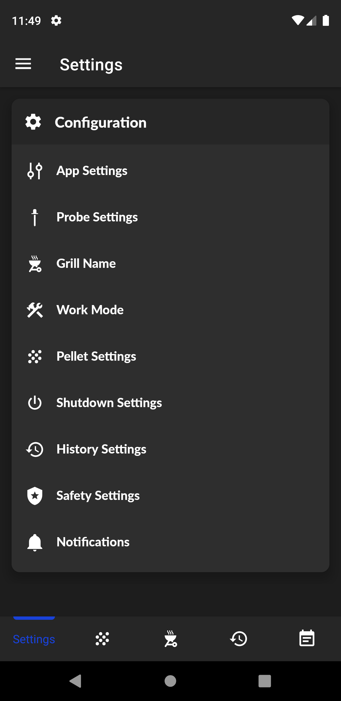
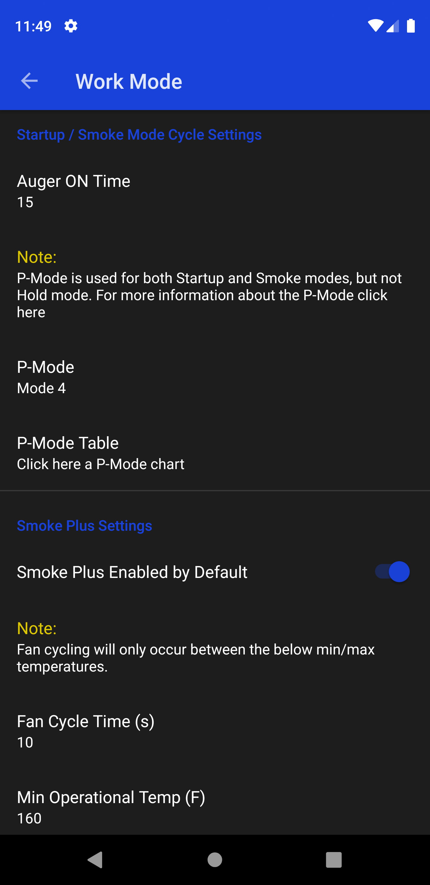

#  PiFire Android
## A native Android app for the PiFire smoker project

### Introduction
This app was created to work with the PiFire smoker project. I wanted a native Android app to control my smoker using the awesome PiFire project so I created this.

## Screenshots
Dashboard | History | Event Log | Pellet Manager
----------|---------|-----------|----------------
 |  |  | 

Settings | Work Mode | Admin | Drawer
---------|-----------|-------|--------
 |  |  | 

## Documentation

This application supports two versions of the PiFire server, the main PiFire project and another version that adds the option for a second grill probe with an updated PCB I designed located [here](https://easyeda.com/zipster85/pifire-controller-hat) More discussion on that can be found in the PiFire discussions [here](https://github.com/nebhead/PiFire/discussions/28#discussioncomment-1006962)

The main PiFire branch now supports the Android app you can find it [here](https://github.com/nebhead/PiFire)

Multi Grill Probe version [here](https://github.com/weberbox/PiFire/tree/fourprobes)


There are currently two Android versions that can be downloaded

Github Firebase – This supports push notifications directly to the application from PiFire. It was redesigned so it no longer requires custom compiling the Android source and signing up for Firebase etc. You can enable Firebase notifications from the app once you have connected to a PiFire server. This version requires the device to have Google play services installed.

Github NonFirebase – This version does not support mobile push notifications in the Android app. Pushbullet, Pushover, IFTTT, etc are still supported by the server but PiFire Android will not receive push notifications directly. This version does not require Google play services installed.

Self Compile Option

There is also another version version that can be self compiled. This is pretty straight forward like any other Android project, just download the source code from here and import the project to Android Studio. There usually will be a few prompts to download any required SDK's or dependencies. Once everything has downloaded you will need to open the Build Variants menu usually located in the lower left corner of Android Studio and change to Compile Non Firebase

If you want to self compile and use Firebase you would need to setup a Google Firebase account and download the google-services.json file as well as host an app server instance somewhere to communicate with Google Firebase. The scope of this project will not cover how to do this but it is possible if you desire. You can also utilize the Sentry crash reporting if you sign up for an account and enter your own dsn in defaults.xml

### Warnings

The creator of this project takes no responsibility for any damage that you may do to your personal property including modifications to your smoker grill if you choose to use this project.  The creator also takes no responsibility for any resulting harm or damages that may come from issues with the hardware or software design.*  ***This project is provided for educational purposes, and should be attempted only by individuals who wish to assume all risks involved.***

### Credits

Android Application created by James Weber, copyright 2021.

* **PiFire** - The core project that this app works with. An awesome project to manage and control your pellet smoker with a Raspberry pi [github](https://github.com/nebhead/PiFire)

* **Socket.IO** - [github](https://github.com/socketio/socket.io-client-java)

* **AnimatedBottomBar** - [github](https://github.com/Droppers/AnimatedBottomBar)

* **zxing-android-embedded** - [github](https://github.com/journeyapps/zxing-android-embedded)

* **EasyPrefs** - [github](https://github.com/Pixplicity/EasyPrefs)

* **PowerSpinner** - [github](https://github.com/skydoves/PowerSpinner)

* **MaterialDesign Icons** - [github](https://github.com/Templarian/MaterialDesign)

* **RecyclerViewFastScroller** - [github](https://github.com/quiph/RecyclerView-FastScroller)

* **MPAndroidChart** - [github](https://github.com/PhilJay/MPAndroidChart)

* **AppUpdater** - [github](https://github.com/javiersantos/AppUpdater)

* **Sentry** - [github](https://github.com/getsentry/sentry-java)

* **Timber** - [github](https://github.com/JakeWharton/timber)

* **OverlappingPanels** - [github](https://github.com/discord/OverlappingPanels)

* **uCrop** - [github](https://github.com/Yalantis/uCrop)

* **TedPermission** - [github](https://github.com/ParkSangGwon/TedPermission)

* **AndroidVeil** - [github](https://github.com/skydoves/AndroidVeil)

* **Alerter** - [github](https://github.com/Tapadoo/Alerter)

* **MaterialRatingBar** - [github](https://github.com/zhanghai/MaterialRatingBar)

* **Glide** - [github](https://github.com/bumptech/glide)

### Licensing

This project is licensed under the GNU GPLv3 license.

```
PiFire Android - Native Android app for the PiFire smoker project

Copyright (c) 2021 James Weber

This program is free software: you can redistribute it and/or modify
it under the terms of the GNU General Public License as published by
the Free Software Foundation, either version 3 of the License, or
(at your option) any later version.

This program is distributed in the hope that it will be useful,
but WITHOUT ANY WARRANTY; without even the implied warranty of
MERCHANTABILITY or FITNESS FOR A PARTICULAR PURPOSE.  See the
GNU General Public License for more details.

You should have received a copy of the GNU General Public License
along with this program.  If not, see <https://www.gnu.org/licenses/>.
```