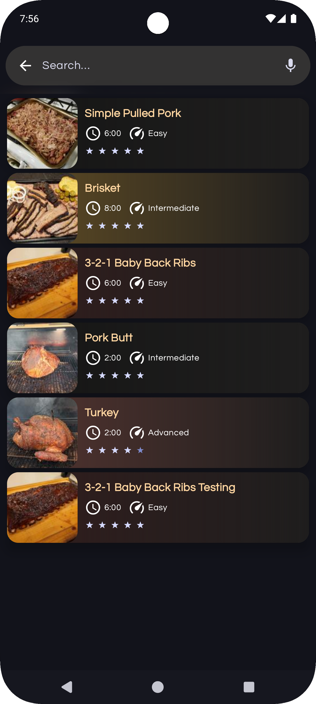
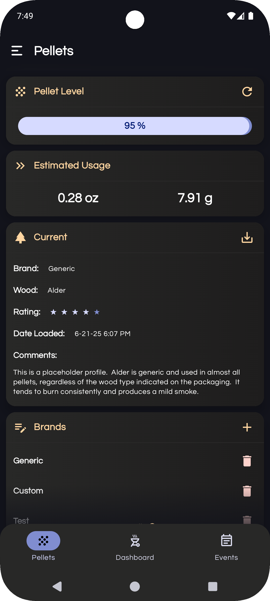

#  PiFire Android
## A native Android app for the PiFire smoker project

### Introduction
This app was created to work with the PiFire smoker project. I wanted a native Android app to control my smoker using the awesome PiFire project so I created this. 

**Note:** I am not a developer by trade and this is just a hobby for me. While I try my best to keep the app stable you may find bugs or experience a crash. If you see something in the code that could be done better please let me know, I am always willing to learn more.

## Screenshots
| Dashboard                                    | Recipes                                  | Pellet Manager                                        | Drawer                                 |
|----------------------------------------------|------------------------------------------|-------------------------------------------------------|----------------------------------------|
|  |  |  |  |

### Warnings

The creator of this project takes no responsibility for any damage that you may do to your personal property including modifications to your smoker grill if you choose to use this project.  The creator also takes no responsibility for any resulting harm or damages that may come from issues with the hardware or software design.*  ***This project is provided for educational purposes, and should be attempted only by individuals who wish to assume all risks involved.***

### Credits

Android Application created by James Weber, copyright 2021-2025.

This app used the following open-source libraries and/or code inspired from these projects.

- [PiFire](https://github.com/nebhead/PiFire)
- [Socket.IO](https://github.com/socketio/socket.io-client-java)
- [Sentry](https://github.com/getsentry/sentry-java)
- [Timber](https://github.com/JakeWharton/timber)
- [Alerter](https://github.com/Tapadoo/Alerter)
- [ComposePreference](https://github.com/zhanghai/ComposePreference)
- [Compose Unstyled](https://github.com/composablehorizons/compose-unstyled)
- [Haze](https://github.com/chrisbanes/haze)
- [Compose Ratingbar](https://github.com/a914-gowtham/compose-ratingbar)
- [OkHttp](https://github.com/square/okhttp)
- [Retrofit](https://github.com/square/retrofit)
- [OneSignal](https://github.com/OneSignal/OneSignal-Android-SDK)
- [Lottie](https://github.com/airbnb/lottie-android)
- [MaterialDesign Icons](https://github.com/Templarian/MaterialDesign)
- [Coil](https://github.com/coil-kt/coil)
- [Zoomable](https://github.com/usuiat/Zoomable)

### Licensing

This project is licensed under the GNU GPLv3 license.

```
PiFire Android - Native Android app for the PiFire smoker project

Copyright (c) 2021-2025 James Weber

This program is free software: you can redistribute it and/or modify
it under the terms of the GNU General Public License as published by
the Free Software Foundation, either version 3 of the License, or
(at your option) any later version.

This program is distributed in the hope that it will be useful,
but WITHOUT ANY WARRANTY; without even the implied warranty of
MERCHANTABILITY or FITNESS FOR A PARTICULAR PURPOSE.  See the
GNU General Public License for more details.

You should have received a copy of the GNU General Public License
along with this program.  If not, see <https://www.gnu.org/licenses/>.
```