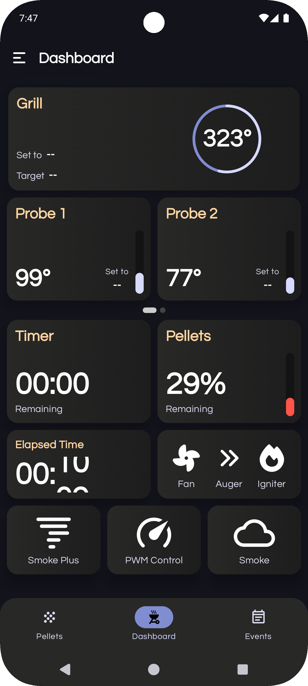
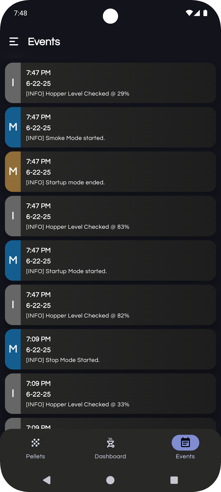
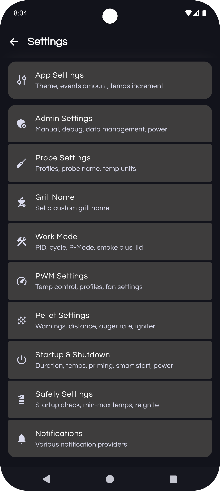

#  PiFire Android
## A native Android app for the PiFire smoker project

***Warning:*** *The creator of this project takes no responsibility for any damage that you may do to your personal property including modifications to your smoker grill if you choose to use this project.  The creator also takes no responsibility for any resulting harm or damages that may come from issues with the hardware or software design.*  ***This project is provided for educational purposes, and should be attempted only by individuals who wish to assume all risks involved.***

### Introduction
This app was created to work with the PiFire smoker project. I wanted a native android app to control my smoker using the great PiFire project. For this app to work it requires a specific version of the PiFire server as of this writing. It is currently being tested and maybe someday will make it into the official release channel of PiFire. 

### Screenshots











## Documentation

To run this app with PiFire it requires an updated version of the PiFire project. There are two versions of the server, one with the standard config and closest to the normal PiFire release and another version that adds the option for a second grill probe with the updated PCB I designed located [here](https://easyeda.com/zipster85/pifire-controller-hat) More discussion on that can be found in the PiFire discussions [here](https://github.com/nebhead/PiFire/discussions/28#discussioncomment-1006962)

Update: The development branch now supports the android app you can find it [here](https://github.com/nebhead/PiFire/tree/development)

Multi Grill Probe version [here](https://github.com/weberbox/PiFire/tree/mobile-dev-redis-grillprobes)


The app also supports Firebase notifications if you choose to use them. You will need to sign up for your own Firebase project and place the google-services.json into the projects app folder or the compile flavor folder the before you build. You can find some more info about that [here](https://firebase.google.com/docs/cloud-messaging/android/client#register_your_app_with_firebase)

If you want the Firebase messaging to work you will also need to get the Server Key from your Firebase project and save it to your PiFire server. More info on how to get the server key [here](https://developer.clevertap.com/docs/find-your-fcm-sender-id-fcm-server-api-key#)


### Future Ideas To Be (possibly) Implemented  

In this section, I'm going to keep a running list of ideas for possible upgrades in the future.  No guarantees that these will be implemented. 

```
Ideas
	Settings
		Allow offline changes that will sync to PiFire once connected. Timestamp added to server which would be used to determine which settings are the newest version

	Pellet DB
		Allow offline changes that will sync to PiFire once connected. Timestamp added to server which would be used to determine which settings are the newest version

	Manual Control
		Implement a manual control section

	Probe editing
		Implement probe editing secton

```

### Updates

* 9/2021 Initial Release

### Credits

Android Application created by James Weber, copyright 2021. The main PiFire project is created and manager by nebhead at [github](https://github.com/nebhead).

Of course, none of this project would be available without the wonderful and amazing folks below 

* **PiFire** - The core project that this app works with. An amazing project to manage and control your pellet smoker with a Raspberry pi [github](https://github.com/nebhead)

* **Socket.IO** - [github](https://github.com/socketio/socket.io-client-java)

* **AnimatedBottomBar** - [github](https://github.com/Droppers/AnimatedBottomBar)

* **zxing-android-embedded** - [github](https://github.com/journeyapps/zxing-android-embedded)

* **EasyPrefs** - [github](https://github.com/Pixplicity/EasyPrefs)

* **PowerSpinner** - [github](https://github.com/skydoves/PowerSpinner)

* **MaterialDesign Icons** - [github](https://github.com/Templarian/MaterialDesign)

* **MPAndroidChart** - [github](https://github.com/PhilJay/MPAndroidChart)

### Licensing

This project is licensed under the MIT license.

```
MIT License

Copyright (c) 2021 James Weber

Permission is hereby granted, free of charge, to any person obtaining a copy
of this software and associated documentation files (the "Software"), to deal
in the Software without restriction, including without limitation the rights
to use, copy, modify, merge, publish, distribute, sublicense, and/or sell
copies of the Software, and to permit persons to whom the Software is
furnished to do so, subject to the following conditions:

The above copyright notice and this permission notice shall be included in all
copies or substantial portions of the Software.

THE SOFTWARE IS PROVIDED "AS IS", WITHOUT WARRANTY OF ANY KIND, EXPRESS OR
IMPLIED, INCLUDING BUT NOT LIMITED TO THE WARRANTIES OF MERCHANTABILITY,
FITNESS FOR A PARTICULAR PURPOSE AND NONINFRINGEMENT. IN NO EVENT SHALL THE
AUTHORS OR COPYRIGHT HOLDERS BE LIABLE FOR ANY CLAIM, DAMAGES OR OTHER
LIABILITY, WHETHER IN AN ACTION OF CONTRACT, TORT OR OTHERWISE, ARISING FROM,
OUT OF OR IN CONNECTION WITH THE SOFTWARE OR THE USE OR OTHER DEALINGS IN THE
SOFTWARE.
```
